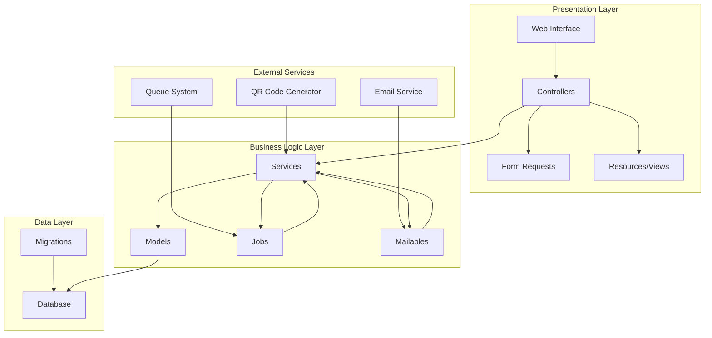
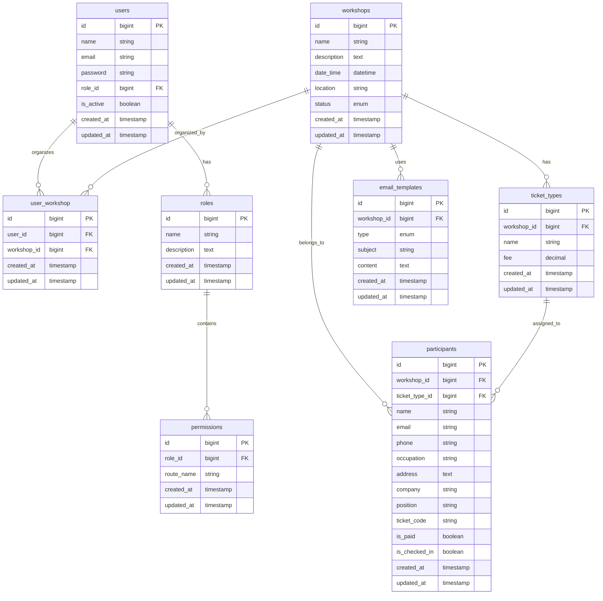

# Design Document - Internal Workshop Management System

## Overview

The Internal Workshop Management System is a Laravel 11-based web application designed to manage internal workshops and courses. The system provides role-based access control, comprehensive workshop lifecycle management, participant registration, QR code ticketing, email automation, and analytics dashboard.

The system is built using Laravel's MVC architecture with additional service layers for business logic, following Laravel best practices and conventions. The frontend utilizes **Metronic 8.2.6 Bootstrap Admin Theme** located in `public/demo1` for a professional and responsive user interface.

### Frontend Technology Stack
- **Metronic 8.2.6** - Premium Bootstrap admin theme
- **Bootstrap 5** - CSS framework
- **jQuery** - JavaScript library
- **DataTables** - Advanced table functionality
- **FullCalendar** - Calendar integration
- **Chart.js** - Data visualization
- **Select2** - Enhanced select boxes
- **Toastr** - Notification system

## Architecture

### System Architecture



### Database Architecture



## Components and Interfaces

### Models

#### User Model (Extended)
- Extends existing Laravel User model
- Relationships: belongsTo Role, belongsToMany Workshop
- Scopes: active users, by role
- Attributes: role_id, is_active

#### Role Model
- Properties: name, description
- Relationships: hasMany User, hasMany Permission
- Methods: hasPermission(), getRoutePermissions()

#### Permission Model
- Properties: role_id, route_name
- Relationships: belongsTo Role
- Validation: unique route per role

#### Workshop Model
- Properties: name, description, date_time, location, status
- Relationships: belongsToMany User (organizers), hasMany TicketType, hasMany Participant, hasMany EmailTemplate
- Scopes: active, upcoming, past
- Status enum: draft, published, ongoing, completed, cancelled

#### TicketType Model
- Properties: workshop_id, name, fee
- Relationships: belongsTo Workshop, hasMany Participant
- Validation: fee >= 0

#### Participant Model
- Properties: workshop_id, ticket_type_id, name, email, phone, occupation, address, company, position, ticket_code, is_paid, is_checked_in
- Relationships: belongsTo Workshop, belongsTo TicketType
- Mutators: generateTicketCode()
- Scopes: paid, checked_in

#### EmailTemplate Model
- Properties: workshop_id, type, subject, content
- Relationships: belongsTo Workshop
- Type enum: invite, confirm, ticket, reminder, thank_you
- Methods: renderContent()

### Controllers

#### UserController
- CRUD operations for users
- Role assignment
- User activation/deactivation
- Filtering by role

#### RoleController
- CRUD operations for roles
- Permission management
- Route permission assignment

#### WorkshopController
- CRUD operations for workshops
- Organizer assignment
- Status management

#### TicketTypeController
- CRUD operations for ticket types
- Workshop association
- Deletion validation

#### ParticipantController
- CRUD operations for participants
- Excel import functionality
- Payment status management
- Check-in management

#### CheckInController
- QR code scanning
- Participant verification
- Check-in processing

#### EmailTemplateController
- CRUD operations for email templates
- Template preview
- Variable substitution testing

#### DashboardController
- Statistics aggregation
- Analytics data
- Revenue calculations

### Services

#### RolePermissionService
- Route permission checking
- Role-based access control
- Permission validation

#### WorkshopService
- Workshop lifecycle management
- Organizer assignment
- Status transitions

#### ParticipantService
- Participant registration
- Excel import processing
- Ticket code generation

#### QRCodeService
- QR code generation using SimpleSoftwareIO/simple-qrcode
- Code validation
- Image generation

#### EmailService
- Template rendering
- Variable substitution
- Email dispatch coordination

#### CheckInService
- QR code decoding
- Participant lookup
- Check-in processing

#### StatisticsService
- Workshop metrics calculation
- Revenue aggregation
- Attendance tracking

### Jobs

#### SendTicketEmailJob
- Queued email sending
- QR code attachment
- Error handling and retry logic

#### ProcessParticipantImportJob
- Excel file processing
- Batch participant creation
- Progress tracking

### Mailables

#### TicketMailable
- Ticket email with QR code
- Template-based content
- Variable substitution

#### WorkshopNotificationMailable
- General workshop notifications
- Template-based content
- Multiple email types support

### Form Requests

#### UserRequest
- User creation/update validation
- Role assignment validation

#### WorkshopRequest
- Workshop data validation
- Date/time validation

#### ParticipantRequest
- Participant data validation
- Email uniqueness per workshop

#### TicketTypeRequest
- Ticket type validation
- Fee validation

#### EmailTemplateRequest
- Template content validation
- Variable syntax checking

### Middleware

#### CheckRoutePermissionMiddleware
- Route-based permission checking
- Role validation
- 403 error handling

## Data Models

### Database Schema Design

#### Users Table Extensions
```sql
ALTER TABLE users ADD COLUMN role_id BIGINT UNSIGNED;
ALTER TABLE users ADD COLUMN is_active BOOLEAN DEFAULT TRUE;
ALTER TABLE users ADD FOREIGN KEY (role_id) REFERENCES roles(id);
```

#### Core Tables
- roles: id, name, description, timestamps
- permissions: id, role_id, route_name, timestamps
- workshops: id, name, description, date_time, location, status, timestamps
- user_workshop: id, user_id, workshop_id, timestamps
- ticket_types: id, workshop_id, name, fee, timestamps
- participants: id, workshop_id, ticket_type_id, name, email, phone, occupation, address, company, position, ticket_code, is_paid, is_checked_in, timestamps
- email_templates: id, workshop_id, type, subject, content, timestamps

#### Indexes
- users: email (unique), role_id, is_active
- permissions: role_id, route_name (unique together)
- workshops: status, date_time
- participants: workshop_id, ticket_type_id, ticket_code (unique), email
- email_templates: workshop_id, type

## Error Handling

### Validation Errors
- Form Request validation with custom error messages
- Client-side validation for immediate feedback
- Server-side validation for security

### Permission Errors
- 403 Forbidden for unauthorized route access
- Clear error messages indicating required permissions
- Redirect to appropriate pages

### Business Logic Errors
- Ticket type deletion with existing participants
- Workshop deletion with participants
- Duplicate participant registration
- Invalid QR code scanning

### System Errors
- Email sending failures with retry mechanisms
- File upload errors for Excel imports
- Database constraint violations
- Queue processing failures


## Security Considerations

### Authentication
- Laravel's built-in authentication system
- Session-based authentication
- Password hashing with bcrypt

### Authorization
- Role-based access control
- Route-level permissions
- Middleware protection

### Data Protection
- Input validation and sanitization
- SQL injection prevention through Eloquent
- XSS protection with Blade templating
- CSRF protection on forms

### File Upload Security
- Excel file validation
- File type restrictions
- Size limitations
- Secure file storage

## Performance Optimization

### Database Optimization
- Proper indexing strategy
- Eager loading for relationships
- Query optimization
- Database connection pooling

### Caching Strategy
- Route caching
- Configuration caching
- View caching
- Permission caching

### Queue Processing
- Background job processing
- Email queue management
- Import processing queues
- Failed job handling

### Asset Optimization
- CSS/JS minification
- Image optimization for QR codes
- CDN integration potential
- Browser caching headers
## F
rontend Architecture

### Metronic Theme Integration

The system utilizes Metronic 8.2.6 theme located in `public/demo1` with the following structure:

#### Layout Structure
- **Main Layout**: Dark sidebar layout (`layouts/dark-sidebar.html`)
- **Header**: Fixed header with user profile and notifications
- **Sidebar**: Collapsible navigation menu with role-based items
- **Content Area**: Main content with breadcrumbs and page titles
- **Footer**: System information and links

#### View Organization
```
resources/views/
├── layouts/
│   ├── app.blade.php (Main Metronic layout)
│   ├── auth.blade.php (Authentication layout)
│   └── partials/
│       ├── header.blade.php
│       ├── sidebar.blade.php
│       └── footer.blade.php
├── dashboard/
│   └── index.blade.php
├── workshops/
│   ├── index.blade.php
│   ├── create.blade.php
│   ├── edit.blade.php
│   └── show.blade.php
├── participants/
│   ├── index.blade.php
│   ├── create.blade.php
│   ├── import.blade.php
│   └── checkin.blade.php
├── users/
│   ├── index.blade.php
│   ├── create.blade.php
│   └── edit.blade.php
└── roles/
    ├── index.blade.php
    ├── create.blade.php
    └── permissions.blade.php
```

#### Asset Management
- **CSS**: Metronic's bundled stylesheets (`assets/css/style.bundle.css`)
- **JavaScript**: Metronic's bundled scripts (`assets/js/scripts.bundle.js`)
- **Plugins**: DataTables, Select2, Chart.js, FullCalendar
- **Custom Assets**: Application-specific CSS/JS in `resources/css` and `resources/js`

#### Component Integration
- **DataTables**: For participant lists, workshop management
- **Select2**: For dropdown selections (roles, ticket types)
- **Chart.js**: Dashboard analytics and statistics
- **FullCalendar**: Workshop scheduling and calendar view
- **Toastr**: Success/error notifications
- **SweetAlert2**: Confirmation dialogs
- **Dropzone**: File upload for Excel imports

### User Interface Design

#### Dashboard
- Overview cards showing total workshops, participants, revenue
- Recent workshops table with status indicators
- Analytics charts for attendance and revenue trends
- Quick action buttons for common tasks

#### Workshop Management
- DataTable with search, filter, and pagination
- Status badges (draft, published, ongoing, completed)
- Quick actions (edit, view participants, duplicate)
- Calendar view for workshop scheduling

#### Participant Management
- Advanced DataTable with export functionality
- Bulk actions (check-in, send emails, update payment)
- Excel import with progress indicator
- QR code generation and display

#### Role & Permission Management
- Tree view for permission assignment
- Role-based interface visibility
- User management with role filtering

### Navigation Structure

#### Main Menu (Role-based visibility)
```
Dashboard
├── Overview Statistics
└── Analytics Charts

Workshop Management
├── All Workshops
├── Create Workshop
├── Workshop Calendar
└── Archive

Participant Management
├── All Participants
├── Add Participant
├── Import from Excel
└── Check-in System

User Management (Admin only)
├── All Users
├── Create User
├── Roles & Permissions
└── System Settings

Reports & Analytics
├── Workshop Reports
├── Attendance Reports
├── Revenue Reports
└── Export Data
```

#### Responsive Design
- Mobile-first approach using Bootstrap 5
- Collapsible sidebar for mobile devices
- Touch-friendly interface elements
- Optimized tables with horizontal scrolling
- Mobile-specific navigation patterns